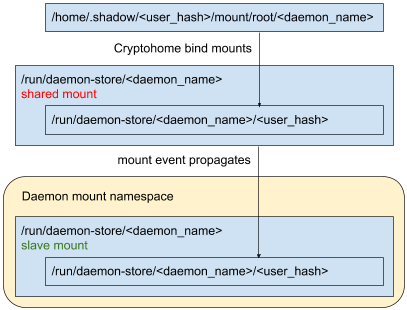

# Sandboxing Chrome OS system services

[TOC]

In Chrome OS, OS-level functionality (such as configuring network interfaces)
is implemented by a collection of system services and provided to Chrome over
D-Bus. These system services have greater system and hardware access than
the Chrome browser.

Separating functionality like this aims to prevent malicious websites from
gaining access to OS-level functionality. If Chrome were able to directly
control network interfaces, then a compromise in Chrome would give an attacker
almost full control over the system. For example, by having a separate network
manager, we can reduce the functionality exposed to an attacker to just querying
interfaces and performing pre-determined actions on them.

Chrome OS uses a few different mechanisms to isolate system services from Chrome
and from each other. We use a helper program called Minijail (executable
`minijail0`). In most cases, Minijail is used in the service's init script. In
other cases, [Minijail wrappers] are used if a service wants to apply
restrictions to the programs that it launches, or to itself.

## Best practices for writing secure system services

Just remember that code has bugs, and these bugs can be used to take control
of the code. An attacker can then do anything the original code was allowed to
do. Therefore, code should only be given the absolute minimum level of
privilege needed to perform its function.

Aim to keep your code lean, and your privileges low. Don't run your service as
`root`. If you need to use third-party code that you didn't write, you should
definitely not run it as `root`.

Use the libraries provided by the system/SDK. In Chrome OS,
[libchrome] and [libbrillo] (née libchromeos) offer a lot of functionality to
avoid reinventing the wheel, poorly. Don't reinvent IPC, use D-Bus or Mojo.
Don't open listening sockets, connect to the required service.

Don't (ab)use shell scripts, shell script logic is harder to reason about and
[shell command-injection bugs] are easy to miss. If you need functionality
separated from your main service, use normal C++ binaries, not shell scripts.
Moreover, when you execute them, consider further restricting their privileges
(see section [Minijail wrappers]).

## Just tell me what I need to do

*   Create a new user for your service: https://crrev.com/c/225257
*   Optionally, create a new group to control access to a resource and add the
    new user to that group: https://crrev.com/c/242551
*   Use Minijail to run your service as the user (and group) created in the
    previous step. In your init script:
    *   `exec minijail0 -u <user> /full/path/to/binary`
    *   See section [User ids].
*   If your service fails, you might need to grant it capabilities. See section
    [Capabilities].
*   Use as many namespaces as possible. See section [Namespaces].
*   Consider reducing the kernel attack surface exposed to your service by
    using seccomp filters, see section [Seccomp filters].
*   Add your sandboxed service to the [security.SandboxedServices] test.

## User ids

The first sandboxing mechanism is user ids. We try to run each service as its
own user id, different from the `root` user, which allows us to restrict what
files and directories the service can access, and also removes a big chunk of
system functionality that's only available to the root user. Using the
`permission_broker` service as an example, here's its Upstart config file (lives
in `/etc/init`):

[`permission_broker.conf`](https://chromium.googlesource.com/chromiumos/platform2/+/master/permission_broker/permission_broker.conf)

```bash
start on starting system-services
stop on stopping system-services
respawn

# Run as 'devbroker' user.
exec minijail0 -u devbroker -c 'cap_chown,cap_fowner+eip' -- \
    /usr/bin/permission_broker
```

Minijail's `-u` argument forces the target program (in this case
`permission_broker`) to be executed as the devbroker user, instead of the root
user. This is equivalent of doing `sudo -u devbroker`.

The user (`devbroker` in this example) needs to first be added to the build
system database. An example of this (for a different user) can be found in the
following CL:
https://crrev.com/c/361830

Next, the user needs to be *installed* on the system. An example of this (again
for a different user) can be found in the following CL:
https://crrev.com/c/383076

See the [Chrome OS user accounts README] for more details.

There's a test in the CQ that keeps track of the users present on the system
that request additional access (e.g. listing more than one user in a group).
If your user does that, the test baseline has to be updated at the same time
the accounts are added with another CL (e.g. https://crrev.com/c/894192).
If you're unsure whether you need this, the PreCQ/CQ will reject your CL when
the test fails, so if the tests pass, you should be good to go!

You can use CQ-DEPEND to land the CLs together
(see [How do I specify the dependencies of a change?]).

## Capabilities

Some programs, however, require some of the system access usually granted only
to the root user. We use [Linux capabilities] for this. Capabilities allow us
to grant a specific subset of root's privileges to an otherwise unprivileged
process. The link above has the full list of capabilities that can be granted
to a process. Some of them are equivalent to root, so we avoid granting those.
In general, most processes need capabilities to configure network interfaces,
access raw sockets, or performing specific file operations. Capabilities are
passed to Minijail using the `-c` switch. `permission_broker`, for example,
needs capabilities to be able to `chown(2)` device nodes.

[`permission_broker.conf`](https://chromium.googlesource.com/chromiumos/platform2/+/master/permission_broker/permission_broker.conf)

```bash
start on starting system-services
stop on stopping system-services
respawn

# Run as <devbroker> user.
# Grant CAP_CHOWN and CAP_FOWNER.
exec minijail0 -u devbroker -c 'cap_chown,cap_fowner+eip' -- \
    /usr/bin/permission_broker
```

Capabilities are expressed using the format that [cap_from_text(3)] accepts.

## Namespaces

Many resources in the Linux world can be isolated now such that a process has
its own view of things. For example, it has its own list of mount points, and
any changes it makes (unmounting, mounting more devices, etc...) are only
visible to it. This helps keep a broken process from messing up the settings
of other processes.

For more in-depth details, see the [namespaces overview].

In Chromium OS, we like to see every process/daemon run under as many unique
namespaces as possible. Many are easy to enable/rationalize about: if you don't
use a particular resource, then isolating it is straightforward. If you do
rely on it though, it can take more effort.

Here's a quick overview. Use the command line option if the description below
matches your service (or if you don't know what functionality it's talking
about -- most likely you aren't using it!).

*   `--profile=minimalistic-mountns`: This is a good first default that enables
    mount and process namespaces. This only mounts `/proc` and creates a few
    basic device nodes in `/dev`. If you need more things mounted, you can use
    the `-b` (bind-mount) and `-k` (regular mount) flags.
*   `--uts`: Just always turn this on. It makes changes to the host / domain
    name not affect the rest of the system.
*   `-e`: If your process doesn't need network access. This also isolates netlink
    and [UNIX _abstract_ sockets].  Note: D-Bus and syslog use _named_ UNIX sockets,
    so they will still be usable (as long as you bind mounted them).
*   `-l`: If your process doesn't use SysV shared memory or IPC.
*   `-p`: If your process doesn't interact with other process PIDs (other than
    child processes).

The `-N` option does not work on Linux 3.8 systems. So only enable it if you know
your service will run on a newer kernel version otherwise minijail will abort
for the older kernels ([Chromium bug 729690](https://crbug.com/729690)).

*   `-N`: If your process doesn't need to modify common
    [control groups settings].

### Passing Common Resources

When using many namespaces to isolate a service, there are some resources
that the service still reasonably should be able to access.

*  syslog: If using `-d` to mount a minimal /dev, you can pass access to the
   syslog daemon by using `-b /dev/log`. If your process mounts all of /dev, you
   need to use `-b /run/systemd/journal` since /dev/log is a symlink to
   /run/systemd/journal/dev-log. In either case, you do not need to specify the
   writable flag to `-b` for this to work. This will work across all namespaces
   (including `-e` network).
*  D-Bus: You can access the system D-Bus by using `-b /run/dbus`.
   You do not need to specify the writable flag to `-b` for this to work.
   This will work across all namespaces (including `-e` network and `-p` pid).
*  Nameservers: If you need to resolve hostnames (DNS), you'll need to pass
   `-b /run/shill` as that daemon maintains the `/etc/resolv.conf` file.

## Seccomp filters

Removing access to the filesystem and to root-only functionality is not enough
to completely isolate a system service. A service running as its own user id
and with no capabilities has access to a big chunk of the kernel API. The
kernel therefore exposes a huge attack surface to non-root processes, and we
would like to restrict what kernel functionality is available for sandboxed
processes.

The mechanism we use is called [Seccomp-BPF]. Minijail can take a policy file
that describes what syscalls will be allowed, what syscalls will be denied, and
what syscalls will only be allowed with specific arguments. The full
description of the policy file language can be found in the
[`syscall_filter.c` source](https://chromium.googlesource.com/aosp/platform/external/minijail/+/master/syscall_filter.c#239).

Abridged policy for
[`mtpd` on amd64 platforms](https://chromium.googlesource.com/chromiumos/platform2/+/master/mtpd/mtpd-seccomp-amd64.policy):

```
# Copyright (c) 2012 The Chromium OS Authors. All rights reserved.
# Use of this source code is governed by a BSD-style license that can be
# found in the LICENSE file.
read: 1
ioctl: 1
write: 1
timerfd_settime: 1
open: 1
poll: 1
close: 1
mmap: 1
mremap: 1
munmap: 1
mprotect: 1
lseek: 1
# Allow socket(domain==PF_LOCAL) or socket(domain==PF_NETLINK)
socket: arg0 == 0x1 || arg0 == 0x10
# Allow PR_SET_NAME from libchrome's base::PlatformThread::SetName()
prctl: arg0 == 0xf
```

Any syscall not explicitly mentioned, when called, results in the process
being killed. The policy file can also tell the kernel to fail the system call
(returning -1 and setting `errno`) without killing the process:

```
# execve: return EPERM
execve: return 1
```

To write a policy file, run the target program under `strace` and use that to
come up with the list of syscalls that need to be allowed during normal
execution. The [generate_syscall_policy.py script] will take `strace` output
files and generate a policy file suitable for use with Minijail. On top of that,
the `-L` option will print the name of the first syscall to be blocked to
syslog. The best way to proceed is to combine both approaches: use  `strace` and
the script to generate a rough policy, and then use `-L` if you notice your
program is still crashing. Note that the `-L` option should NOT be used in
production.

You should ensure that your service is executing as many of its code paths as
possible when executing `strace`, in particular error paths.  In some cases it
may be easier to add syscalls manually (for instance, `abort`) rather than
forcing execution of those paths.

The policy file needs to be installed in the system, so we need to add it to
the ebuild file:

[`mtpd-9999.ebuild`](https://chromium.googlesource.com/chromiumos/overlays/chromiumos-overlay/+/master/chromeos-base/mtpd/mtpd-9999.ebuild)

```bash
# Install seccomp policy file.
insinto /usr/share/policy
use seccomp && newins "mtpd-seccomp-${ARCH}.policy" mtpd-seccomp.policy
```

And finally, the policy file has to be passed to Minijail, using the `-S`
option:

[`mtpd.conf`](https://chromium.googlesource.com/chromiumos/platform2/+/master/mtpd/mtpd.conf)

```bash
# use minijail (drop root, set no_new_privs, set seccomp filter).
# Mount /proc, /sys, /dev, /run/udev so that USB devices can be
# discovered.  Also mount /run/dbus to communicate with D-Bus.
exec minijail0 -i -I -p -l -r -v -t -u mtp -g mtp -G \
  -P /mnt/empty -b / -b /proc -b /sys -b /dev \
  -k tmpfs,/run,tmpfs,0xe -b /run/dbus -b /run/udev \
  -n -S /usr/share/policy/mtpd-seccomp.policy -- \
  /usr/sbin/mtpd -minloglevel="${MTPD_MINLOGLEVEL}"
```

### Detailed instructions for generating a seccomp policy

*   Generate the syscall log:
  `strace -f -o strace.log <cmd>`
*   When sandboxing a dynamically-linked executable, Minijail will default to
    using `LD_PRELOAD` to install the seccomp filter. This will install the
    filter *after* glibc initialization, so remove the syscalls related to
    glibc initialization to obtain a smaller filter (and a tighter sandbox).
    Those are normally everything up to and including the following:

```
rt_sigaction(SIGRTMIN, {<sa_handler>, [], SA_RESTORER|SA_SIGINFO, <sa_restorer>}, NULL, 8) = 0
rt_sigaction(SIGRT_1, {<sa_handler>, [], SA_RESTORER|SA_RESTART|SA_SIGINFO, <sa_restorer>}, NULL, 8) = 0
rt_sigprocmask(SIG_UNBLOCK, [RTMIN RT_1], NULL, 8) = 0
getrlimit(RLIMIT_STACK, {rlim_cur=8192*1024, rlim_max=RLIM64_INFINITY}) = 0
brk(NULL)                               = <addr>
brk(<addr>)                             = <addr>
```

*   Run the policy generation script:
    *   `~/chromiumos/src/aosp/external/minijail/tools/generate_seccomp_policy.py strace.log > seccomp.policy`
*   Test the policy (look at /var/log/messages for the blocked syscall when this
    crashes):
    *   `minijail0 -S seccomp.policy -L <cmd>`
*   When not using the `-n` Minijail flag, privilege-dropping syscalls happen
    after the filter is installed, and they won't show up in normal program
    execution because they're called by Minijail itself. They need to be added
    to the policy:
    *   `setgroups(2)`, `setresgid(2)`, and `setresuid(2)` for dropping root.
    *   `capget(2)`, `capset(2)`, and `prctl(2)` for dropping capabilities.
    *   Normally, it's just easier to use the `-n` flag (`no_new_privs`),
        which prevents the sandboxed process from obtaining new privileges and
        is therefore a good addition for sandboxing.
*   To find a failing syscall without having seccomp logs available (i.e., when
    minijail0 was run without the `-L` option):
    *   `dmesg | grep "syscall="` to find something similar to:

```
NOTICE kernel: [  586.706239] audit: type=1326 audit(1484586246.124:6): ... comm="<executable>" exe="/path/to/executable" sig=31 syscall=130 compat=0 ip=0x7f4f214881d6 code=0x0
```

*   Then do:
    *   `minijail0 -H | grep <nr>`, where `<nr>` is the `syscall=` number
        above, to find the name of the failing syscall.
    *   NB: You need to run `minijail0` on the same system as your program as
        the system call tables might be different from the SDK (e.g. x86 is not
        the same as arm).
    *   If you do not want to allow an entire syscall, you can only allow
        certain parameters, e.g. `ioctl: arg1 == FDGETPRM`. When the program
        crashes due to a seccomp filter failure, you can use the minidump to
        find the arguments to allow using the [syscall calling conventions].
    *   For an online list of syscalls, check out our [syscalls table].

*   Sometimes Minijail will fail to compile the seccomp filter with an error
    similar to:

```
WARNING minijail0[32315]: libminijail[32315]: trailing garbage after constant: 'LOOP_GET_STATUS64'
WARNING minijail0[32315]: libminijail[32315]: compile_atom: /usr/share/policy/e2fsck-seccomp.policy(13): invalid constant 'LOOP_GET_STATUS64'
WARNING minijail0[32315]: libminijail[32315]: could not allocate filter block
WARNING minijail0[32315]: libminijail[32315]: compile_filter: compile_file() failed
ERR minijail0[32315]: libminijail[32315]: failed to compile seccomp filter BPF program in '/usr/share/policy/e2fsck-seccomp.policy'
```

   * This means that one of the constant parameters provided to a syscall could
     not be resolved: e.g. `ioctl: arg1 == LOOP_GET_STATUS64`.
   * To fix this, look up the hex value of the constant and substitute the
     constant e.g. `ioctl: arg1 == 0x4C05`.
   * Minijail resolves these constants based on headers that are in
     [gen_constants-inl.h].

### Generating seccomp policies on 4.14+ kernels

On kernels 4.14 and above we can use the new `SECCOMP_RET_LOG` return value to
make policy generation easier. On these kernels, the `-L` Minijail option will
use `SECCOMP_RET_LOG` as the return value for blocked syscalls: those not listed
in the policy or whose arguments don't match the policy. Instead of killing the
process on a blocked syscall, the kernel will log the otherwise blocked syscall
but will effectively allow it.

The advantage of this mechanism versus what we have available in pre-4.14
kernels is that instead of having to add syscalls to the policy one by one, you
can run the process with `-L`, get a list of all the syscalls not included in
the policy, review them, and add the necessary ones, all in one step.

As an example, say I have an empty policy:

```sh
# touch empty.policy
```

Since the policy is empty, all syscalls are blocked and even a trivial binary
like `true` fails, so Mìnijail returns a non-zero exit code:

```sh
# minijail0 -S empty.policy -n -- /bin/true
# echo $?
253
```

When adding `-L` to the Minijail command line, this new mode allows all system
calls, so `true` succeeds:

```sh
# minijail0 -S empty.policy -n -L -- /bin/true
# echo $?
0
```

Now we can check the logs for the logged-but-allowed syscalls:

```sh
# journalctl -g SECCOMP | grep true
Jul 19 10:54:26 audit[5231]: SECCOMP auid=0 uid=0 gid=0 ses=6 subj=u:r:minijail:s0 pid=5231 comm="true" exe="/usr/bin/coreutils" sig=0 arch=c000003e syscall=157 compat=0 ip=0x7f7078eaa9da code=0x7ffc0000
Jul 19 10:54:26 audit[5231]: SECCOMP auid=0 uid=0 gid=0 ses=6 subj=u:r:minijail:s0 pid=5231 comm="true" exe="/usr/bin/coreutils" sig=0 arch=c000003e syscall=157 compat=0 ip=0x7f7078eaa9da code=0x7ffc0000
Jul 19 10:54:26 audit[5231]: SECCOMP auid=0 uid=0 gid=0 ses=6 subj=u:r:minijail:s0 pid=5231 comm="true" exe="/usr/bin/coreutils" sig=0 arch=c000003e syscall=231 compat=0 ip=0x7f7078e745e6 code=0x7ffc0000
```

Looks like `true` needs syscall 157 (`prctl`, called twice) and 231
(`exit_group`). To find the name of the syscall matching a number you can check
Chrome OS's [syscalls table] or use Minijail's `-H` command-line option:

```sh
# minijail0 -H | grep 157
  prctl [157]
# minijail0 -H | grep 231
  exit_group [231]
```

Our recommendation is to combine this mechanism with the `strace`-based
mechanism above: run the process to be sandboxed under `strace`, generate a base
policy using the policy generation script, and then refine it using `-L`.

## Securely mounting cryptohome daemon store folders

Some daemons store user data on the user's cryptohome under
`/home/.shadow/<user_hash>/mount/root/<daemon_name>` or equivalently
`/home/root/<user_hash>/<daemon_name>`. For instance, Session Manager stores
user policy under `/home/root/<user_hash>/session_manager/policy`. This is
useful if the data should be protected from other users since the user's
cryptohome is only mounted (and therefore decrypted) when the user logs in. If
the user is not logged in, it is encrypted with the user's password.

However, if a daemon is already running inside a mount namespace (`minijail0 -v
...`) when the user's cryptohome is mounted, it does not see the mount since
mount events do not propagate into mount namespaces by default. This propagation
can be achieved, though, by making the parent mount a shared mount and the
corresponding mount inside the namespace a shared or slave mount, see the
[shared subtrees] doc.

To set up a cryptohome daemon store folder that propagates into your daemon's
mount namespace, add this code to the `src_install` section of your daemon's
ebuild:

```bash
local daemon_store="/etc/daemon-store/<daemon_name>"
dodir "${daemon_store}"
fperms 0700 "${daemon_store}"
fowners <daemon_user>:<daemon_group> "${daemon_store}"
```

This directory is never used directly. It merely serves as a secure template for
the `chromeos_startup` script, which picks it up and creates
`/run/daemon-store/<daemon_name>` as a shared mount.

Next, move the user/group setup to `pkg_setup()` since `pkg_preinst()`, where
this is usually done, runs after `src_install()`:

```bash
pkg_setup() {
	# Has to be done in pkg_setup() instead of pkg_preinst() since
	# src_install() needs <daemon_user> and <daemon_group>.
	enewuser <daemon_user>
	enewgroup <daemon_group>
	cros-workon_pkg_setup
}
```

In your daemon's init script, mount the daemon store folder as slave in your
mount namespace. Be sure not to mount all of `/run`. Make sure to mount with the
`MS_REC` flag to propagate any already-mounted cryptohome bind mounts into the
mount namespace.

```bash
minijail0 -v -Kslave \
          -k 'tmpfs,/run,tmpfs,MS_NOSUID|MS_NODEV|MS_NOEXEC' \
          -k '/run/daemon-store/<daemon_name>,/run/daemon-store/<daemon_name>,none,MS_BIND|MS_REC' \
          ...
```

During sign-in, when the user's cryptohome is mounted, Cryptohome creates
`/home/.shadow/<user_hash>/mount/root/<daemon_name>`, bind-mounts it to
`/run/daemon-store/<daemon_name>/<user_hash>` and copies ownership and mode from
`/etc/daemon-store/<daemon_name>` to the bind target. Since
`/run/daemon-store/<daemon_name>` is a shared mount outside of the mount
namespace and a slave mount inside, the mount event propagates into the daemon.

Your daemon can now use `/run/daemon-store/<daemon_name>/<user_hash>` to store
user data once the user's cryptohome is mounted. Note that even though
`/run/daemon-store` is on a tmpfs, your data is actually stored on disk and not
lost on reboot.

**Be sure not to write to the folder before the cryptohome is mounted**.
Consider listening to Session Manager's `SessionStateChanged` signal or similar
to detect mount events. Note that `/run/daemon-store/<daemon_name>/<user_hash>`
might exist even though cryptohome is not mounted, so testing existence is not
enough (it only works the first time).

The `<user_hash>` can be retrieved with Cryptohome's `GetSanitizedUsername`
D-Bus method.

The following diagram illustrates the mount event propagation:



## Minijail wrappers

TODO(jorgelo)

[Minijail wrappers]: #Minijail-wrappers
[User ids]: #User-ids
[Capabilities]: #Capabilities
[Namespaces]: #Namespaces
[Seccomp filters]: #Seccomp-filters
[UNIX _abstract_ sockets]: http://man7.org/linux/man-pages/man7/unix.7.html
[security.SandboxedServices]: https://chromium.googlesource.com/chromiumos/platform/tast-tests/+/refs/heads/master/src/chromiumos/tast/local/bundles/cros/security/sandboxed_services.go

[libchrome]: packages/libchrome.md
[libbrillo]: http://www.chromium.org/chromium-os/packages/libchromeos
[shell command-injection bugs]: http://en.wikipedia.org/wiki/Code_injection#Shell_injection
[Chrome OS user accounts README]: https://chromium.googlesource.com/chromiumos/overlays/eclass-overlay/+/master/profiles/base/accounts/README.md
[How do I specify the dependencies of a change?]: contributing.md#CQ-DEPEND
[Linux capabilities]: http://man7.org/linux/man-pages/man7/capabilities.7.html
[capability.h]: https://git.kernel.org/pub/scm/linux/kernel/git/torvalds/linux.git/tree/include/uapi/linux/capability.h
[cap_from_text(3)]: http://man7.org/linux/man-pages/man3/cap_from_text.3.html
[namespaces overview]: http://man7.org/linux/man-pages/man7/namespaces.7.html
[control groups settings]: http://man7.org/linux/man-pages/man7/cgroups.7.html
[Seccomp-BPF]: https://www.kernel.org/doc/Documentation/prctl/seccomp_filter.txt
[`syscall_filter.c` source]: https://chromium.googlesource.com/aosp/platform/external/minijail/+/master/syscall_filter.c#239
[generate_syscall_policy.py script]: https://chromium.googlesource.com/aosp/platform/external/minijail/+/master/tools/generate_seccomp_policy.py
[shared subtrees]: https://www.kernel.org/doc/Documentation/filesystems/sharedsubtree.txt
[syscalls table]: ./constants/syscalls.md
[syscall calling conventions]: ./constants/syscalls.md#calling-conventions
[gen_constants-inl.h]: https://android.googlesource.com/platform/external/minijail/+/refs/heads/master/gen_constants-inl.h
