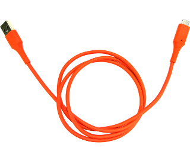

# Closed Case Debug (CCD)

[TOC]

## Introduction

In order to get access to the AP and EC consoles or reprogram a Chrome OS
device's firmware or BIOS without using the AP, older Chrome OS devices required
opening the device to get access to a debug header used by [Servo]. These servo
headers are frequently unpopulated on production units.

Newer Chrome OS devices have a secure microcontroller in them which runs an
embedded OS called Cr50. Among other capabilities, this chip allows developers
to securely debug the device without physically opening it.

Current Cr50 capabilities allow read/write access to a UART on the AP and
read-only UART access to the EC. More interfaces will be exposed in the future.
Eventually it should replace all Servo capabilities.

This document describes basic "Closed Case Debug" (CCD) and debug cable (SuzyQ)
information. For more in depth instructions on using CCD see the following:

*   [General CCD information and background][CCD]
*   [Guide to setting up Cr50 CCD][Cr50 CCD]: Cr50 restricts most CCD features.
    You need to "open" Cr50 CCD and enable access to most Cr50 CCD capabilities.

## Communicating with Cr50

The Cr50 code uses the microcontroller’s USB interface to expose its debugging
functionality. This interface can be reached via a special USB Type-C cable
called "SuzyQ" on one of the system’s ports.

To put Cr50 into debug mode, the SuzyQ cable has to present itself as a Debug
Accessory (see Chapter B of the USB Type-C Specification). When this cable is
detected the system will connect the Cr50 full-speed USB2.0 interface to the SBU
pins of the Type-C connector. Note that this prevents use of the DisplayPort
alternate-mode (which also uses the SBU pins) but preserves regular USB
operation on the port.

Once the SuzyQ cable is connected, Cr50 makes several USB endpoints available to
the host to communicate with the consoles, to program firmware, etc. More
details about [setting up Cr50][Cr50 CCD] and these [CCD software interfaces can
be found in the documentation section of the EC codebase][servo_micro ccd].

### SuzyQ / SuzyQable

SuzyQ is a cable that tells the Cr50 to go into debug mode. SuzyQ includes a USB
hub in the cable, which allows the host computer to access both the debug
interface (on the SBU pins) and any gadget-mode interfaces exposed by the
device-under-test (for example an ADB interface for debugging Android
applications). [Reference schematics][SuzyQ Schematics] are available for the
SuzyQ.

This cable is available for purchase from Sparkfun:
https://www.sparkfun.com/products/14746.



*** note
NOTE: The cable will generally only work in one port and one orientation. If it
doesn't work try the other port, or flip the connector. Check the
[Chrome OS device list] for more details about the specific device you are
using.

To see if it worked you can check the presence of `/dev/ttyUSB*` devices, or
monitor `lsusb` for Cr50 device enumeration:

```bash
(chroot) $ watch -n 1 "lsusb | grep 18d1:5014"
```
***

#### Making your own SuzyQ

One needs a [USB Type-C Male breakout board] and some way of connecting the
other end to a computer’s USB port (like a Type A Male port).

Type C Male            | Other host (Type A Male)
---------------------- | ------------------------
A8 (SBU 1)             | D+
B8 (SBU 2)             | D-
A4, A9, B4, B9 (VBUS)  | VBUS, 5V
A5 (CC1)               | 22 kΩ resistor to VBUS
B5 (CC2)               | 56 kΩ resistor to VBUS
A1, A12, B1, B12 (GND) | GND

### Servo v4

[Servo v4] also has CCD capabilities (routing SBU lines to the USB host,
signaling on the CC lines debug accessory mode), so it can be used as an
alternative to the SuzyQ cable. During debugging, Servo v4 will normally allow
the device-under-test to act as a USB host, providing it with an Ethernet
interface and USB flash device that may be used for a recovery image. Servo v4
allows USB Type-C connection automation (both data and charging).

## Using CCD

To use most of the features of CCD, on your Linux workstation you need to
[build Chromium OS][Developer Guide] and create a chroot environment. It’s
possible to use a subset of CCD without that; see the
[Raw Access section](#raw-access).

The [hdctools] \(Chrome OS Hardware Debug & Control Tools) package contains
several tools needed to work with `servod`. Make sure the latest version is
installed in your chroot:

```bash
(chroot) $ sudo emerge hdctools
```

On your workstation, `servod` must also be running to communicate with Cr50:

```bash
(chroot) $ sudo servod -b $BOARD &
```

CPU/AP UART can be accessed by running:

```bash
(chroot) $ miniterm.py --lf `dut-control cpu_uart_pty|cut -d ":" -f 2`
```

Note that on a normal install of Chrome OS the UART is not normally used. The
device must be in [Developer Mode] or using a custom OS.

On most x86 production images the UART drivers are also disabled for performance
reasons, but they can be added back in with a custom AP firmware.

EC UART:

```bash
(chroot) $ miniterm.py --lf `dut-control ec_uart_pty|cut -d ":" -f 2`
```

The console is read only, unless you have [opened CCD][Cr50 CCD]. The console
will show various debug mesages from charging, keyboard scanning, power state.

Cr50 itself has a console available, but most commands are locked by default for
security:

```bash
(chroot) $ miniterm.py --lf `dut-control cr50_uart_pty|cut -d ":" -f 2`
```

#### Features

Most CCD features are locked down by default on Cr50. You need to enable them
before you can use them. For information on setting up Cr50 CCD see the
[GSC CCD setup doc][Cr50 CCD].

*   Control of firmware write protect.
*   Flashing of the AP and EC firmware.
*   EC RW console access.
*   Read I2C INA219 current sensors (though most production boards do not have
    them populated).

### Raw Access {#raw-access}

A subset of these features (e.g., UART lines) can be accessed without a
`cros_sdk` chroot.

Once the SuzyQ is plugged in, three `/dev/ttyUSB` devices will enumerate:

1.  Cr50 console
1.  CPU/AP console (RW)
1.  EC console (RO only)

## Device Support

The "Closed Case Debugging" column in the [Chrome OS device list] indicates
whether CCD is supported.

If the device is ARM, the CPU/AP UART works by default in dev mode (you should
see a login prompt). x86 devices disable it for performance / power reasons, but
[UART can be re-enabled with a custom firmware](https://docs.google.com/presentation/d/1eGPMu03vCxIO0a3oNX8Hmij_Qwwz6R6ViFC_1HlHOYQ/edit#slide=id.gf3c00a91_0218).

[Servo]: ./servo.md
[Servo v4]: ./servo_v4.md
[hdctools]: https://chromium.googlesource.com/chromiumos/third_party/hdctools
[CCD]: https://chromium.googlesource.com/chromiumos/platform/ec/+/master/board/servo_micro/ccd.md
[Cr50 CCD]: https://chromium.googlesource.com/chromiumos/platform/ec/+/master/docs/case_closed_debugging_cr50.md
[servo_micro ccd]: https://chromium.googlesource.com/chromiumos/platform/ec/+/master/board/servo_micro/ccd.md
[USB Type-C Male breakout board]: https://www.google.com/search?q=USB+Type-C+Breakout+Board+Male
[SuzyQ Schematics]: https://www.chromium.org/chromium-os/ccd/951-00273-01_20180607_suzyqable_SCH_1.pdf
[Developer Guide]: https://chromium.googlesource.com/chromiumos/docs/+/master/developer_guide.md
[Developer Mode]: https://chromium.googlesource.com/chromiumos/docs/+/master/developer_mode.md
[Chrome OS device list]: https://www.chromium.org/chromium-os/developer-information-for-chrome-os-devices
