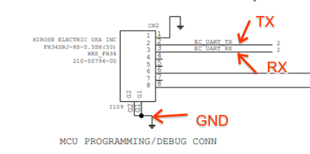

# Servo Micro

Servo Micro (aka "uServo") is a self contained replacement for Yoshi Servo
Flex. It is meant to be compatible with Servo v2/v3 via [`servod`]. The design
uses [Case Closed Debug][CCD] software on an STM32 microcontroller to provide a
[CCD] interface into systems with a Yoshi debug port.

[TOC]

## Overview

Servo Micro is usually paired with a [Servo v4 Type-A], which provides ethernet,
dut hub, and muxed usb storage.

*   [Servo Micro Schematics]
*   [Case Closed Debug with Servo Micro][Servo Micro CCD]

![Servo Micro]

## Use

Like other Servo boards, the Servo Micro requires [`servod`] to be running:

```bash
(chroot) $ sudo servod -b [board]
```

Most Servo header functionality should be available, used in the same way as any
other servo. Here you can see the Servo v4 and Servo Micro plugged into a
system.

![Servo Micro and Servo v4]

### Flashing the BIOS or EC with Servo Micro

Servo Micro can be used to flash the AP BIOS or EC with `flashrom`. Note that
`flashrom`'s command line needs to specify the correct endpoint, which is
`raiden` rather than `ftdi`.

For example, on a 3.3V DUT:

```bash
(chroot) $ dut-control spi2_vref:pp3300 spi2_buf_en:on
(chroot) $ sudo flashrom --programmer raiden_debug_spi -r bios.bin
(chroot) $ dut-control spi2_vref:off spi2_buf_en:off
```

*** note
NOTE: There is no `target=(AP|EC)` command as with other `raiden_debug_spi`
devices. Adding this flag to the `flashrom` command will cause an error.
***

## Known Issues

*   JTAG - Servo Micro does not support JTAG.
*   Servo Micro doesn't support `jtag_vref`, or any `_buf_on_flex` controls.
*   If a Servo Micro is plugged into a DUT without being plugged into a host
    machine, it can cause undefined behavior on the DUT.

## Programming

Servo Micro can update to the latest released firmware with a tool in the
chroot. Note that [`servod`] must not be running as it locks the device:

```bash
(chroot) $ sudo servo_updater -b servo_micro
```

## Developing Servo Micro Firmware

### Compiling

servo micro code lives in the ec codebase. It can be built as follows:

```bash
(chroot) $ cd ~/trunk/src/platform/ec
(chroot) $ make BOARD=servo_micro -j8
```

### Flashing

To flash a working Servo Micro:

```bash
(chroot) $ sudo servo_updater -b servo_micro -f build/servo_micro/ec.bin
```

If the flash is empty or the image is broken, you can flash the Servo Micro
using the `BOOT0` select pin, which is held by USB OTG's ID pin. The easiest way
to do this is to plug a USB OTG adapter into Servo Micro, then plug an A-A cable
into your desktop and Servo Micro.

```bash
(chroot) $ ./util/flash_ec --board=servo_micro
```

![Servo Micro USB OTG]

## Servo Micro UART

Servo Micro exports a console UART over the small header next to the USM-micro
port. There is a rare cable for this header, but it's easier to just rework UART
wires on and use a standard FTDI pin header 3.3V cable.



<!-- Links -->

[Servo Micro Schematics]: https://docs.google.com/viewer?a=v&pid=sites&srcid=Y2hyb21pdW0ub3JnfGRldnxneDo2Njk1MGFiOTRkY2E5MGM5
[CCD]: https://chromium.googlesource.com/chromiumos/platform/ec/+/master/docs/case_closed_debugging.md
[Servo v4 Type-A]: ./servo_v4.md
[Servo Micro CCD]: https://chromium.googlesource.com/chromiumos/platform/ec/+/master/board/servo_micro/ccd.md
[`servod`]: ./servod.md

<!-- Images -->

[Servo Micro]: ./images/servo_micro.jpg
[Servo Micro and Servo v4]: ./images/servo_micro_servo_v4_dut.jpg
[Servo Micro USB OTG]: ./images/servo_micro_usb_otg.jpg
[Servo Micro UART]: ./images/servo_micro_uart.png

