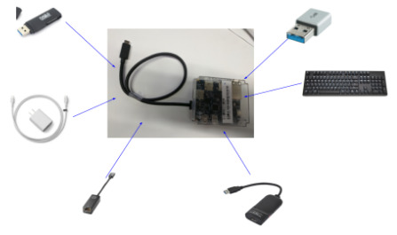
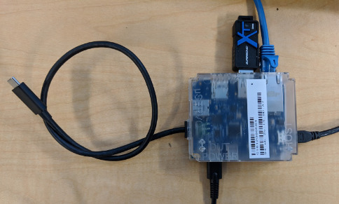
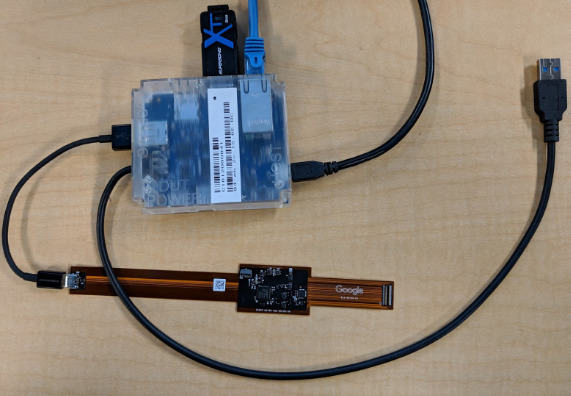

# Servo v4

Servo v4 is a debug device in the Servo family.

Servo v4 functions as a configurable USB hub to support developer and lab
recovery features. However, it doesn't have any hardware debug features on its
own. It must be paired with CCD (Cr50's on-board servo implementation) or
[Servo Micro].

[TOC]

*** note
**Googlers**: gLinux has a 4.19 kernel bug (http://b/123886969) that will cause
USB hang on many devices, including all servo and ADB.

To work around this issue, you can run:

```bash
# Install 4.18 kernel.
apt-get install linux-image-4.18.10-1rodete2-amd64
sudo glinux-config set custom_grub_config yes
sudo update-grub
# Copy 4.18 to the top of the menu as default, or select at boot.
```

**Alternatively, you can enable tracing to help debug the issue:**

Enable tracing:

```bash
echo 1 | sudo tee /sys/kernel/debug/tracing/events/xhci-hcd/enable
```

See this for more details:
http://g/chromeos-chatty-eng/tWChV-rkCHw/0JO8VG2dAgAJ
***

## What is Servo v4?

Servo combines the functionality of the following devices into one:

*   Ethernet-USB dongle
*   Muxable USB port
*   uSD to USB3.0 dongle
*   Keyboard emulator
*   Pass through charger

Details:

*   [Servo v4 Block Diagram]
*   [Servo v4 Schematic]



## Getting Servo v4

*** promo
Sorry, Servo v4 is not publicly available for purchase.
***

### Partners

Your contact at Google should be able to provide you with Servo v4.

### Googlers

Stop by your local Chromestop. You will need to
[update the firmware](#updating-firmware) before using, as the factory firmware
is quite old.

## How to Use Servo v4

Servo v4 can be plugged into a host machine using a uB USB cable. This will
power Servo v4 while allowing the user to control Servo v4 using [`servod`].

The DUT connector (which is a captive cable) can be plugged into a DUT,
providing the DUT access to the ethernet and blue USB port.

The Type-C captive cable enables debugging of devices that have a Cr50 (recent
Chromebooks) through [CCD].

The "uServo" USB port can be used to plug a servo micro to debug devices over
the Yoshi debug header.

From here other functionality is available. The following ports can be used to
download data to a device:

*   Ethernet
*   uSD card
*   USB stick

Additionally Servo v4 can be used to power the DUT which becomes useful for
devices that use USB as their only charge port (tablets, phones etc.). The
Type-C port can be used to plug in any Type-C charger to provide full charging
capabilities as a charge through hub. If no charger is plugged, Servo v4 will
act as a passive hub.

Servo v4 has an embedded keyboard so keystrokes can be emulated on the DUT.

The [`servod`] server must be running for Servo v4 to work. Details can be
found on the [Servo] page.

## Type-A vs Type-C Variants

There are two variants of Servo V4: Type-A and Type-C.

Both versions use the same board and case, but have a different captive cable
stuffed.

### Type-C Version

The Type-C version acts as both a USB hub and PD charger. Servo v4 can also
control both CC terminations which allows it to act as a debug accessory. It
should be used on systems with [CCD].

*** note
NOTE: Type-C Servo v4 is a charge-through hub and is NOT functionally equivalent
to a Type-A servo with an A-to-C adapter. DO NOT use a Type-C Servo v4 just
because you want to plug into a Type-C port. Older Chromebooks (Eve, Samus,
etc.) have [EC] bugs that prevent charge through hubs from working correctly.
***



### Type-A Version

The Type-A version is used with a uServo and serves as the DUT USB hub, with
the uServo providing SPI and UART support.



## Servo v4 Revisions

Servo v4 had several revisions, indicated by board color. The mass production
(MP) version is available from Chromestop.

### Green (MP)

Final version, has full functionality.

### Blue (DVT)

The DVT version is completely functional except for the one bug affecting only
Type-C variant. There are about one thousand of these, so you may encounter
them.

*   PD Charge-through only works on chargers up to 10V.
*   Firmware identifies this by board revision and will not negotiate any
    voltages above 10V.

### Red (EVT)

The EVT version is a mostly functioning version with a few bugs. There are
around three hundred of these total.

*   The ethernet IC has a bug in it that makes the device fall out of
    GigE/USB3.0 speeds under certain circumstances and it falls down to USB1.1 /
    2 speeds and never properly recovers until reset.
*   Type-C variant doesn't function, Type-A works OK.

## Software

Servo v4 runs more or less equivalently to Servo v2 and v3, through [`servod`].
It's intended to be mostly transparent, but there are some differences.

Most functionality is exported through `dut-control`.

```bash
(chroot) $ sudo servod -b <board> -s <serial>
```

To use with a specific board, you can connect a servo_micro to the "uServo"
labeled port (or use the Type-C cable to connect to [CCD]) and run [`servod`],
which will load the board config and control both Servo v4 and Servo Micro (or
Cr50).

```bash
(chroot) $ sudo servod -b [board] -s [serialno printed on servo v4 sticker]
```

### Recipes

#### Connect to Servo console without servod

Connect to Servo v4 Console:

```bash
(chroot) $ usb_console -d 18d1:501b
```

Connect to Servo Micro Console:

```bash
(chroot) $ usb_console -d 18d1:501a -i 3
```

Connect to Cr50 Console:

```bash
(chroot) $ usb_console -d 18d1:5014
```

#### Switch SD to Host

```bash
(chroot) $ dut-control sd_en:on sd_pwr_en:on sd_mux_sel:servo_sees_usbkey host_sd_usb_mux_en:on host_sd_usb_mux_sel:sd
```

#### Switch SD to DUT

```bash
(chroot) $ dut-control sd_en:on sd_pwr_en:on sd_mux_sel:dut_sees_usbkey
```

#### Disable SD

```bash
(chroot) $ dut-control sd_en:off sd_pwr_en:off
```

#### Switch USB3 to Host

```bash
(chroot) $ dut-control usb3_mux_en:on usb3_mux_sel:servo_sees_usbkey usb3_pwr_en:on host_sd_usb_mux_en:on host_sd_usb_mux_sel:usb
```

#### Switch USB3 to DUT

```bash
dut-control usb3_mux_en:on usb3_mux_sel:dut_sees_usbkey usb3_pwr_en:on
```

Recipes for Type-C (Using PD firmware)

*   Disable / Enable SuzyQ wiring / Debug accessory mode:
    *   `dut-control servo_v4_dts_mode:off [on]`
*   Disable / Enable Chargethrough:
    *   `dut-control servo_v4_role:snk [src]`

## Flashrom

*** note
For [CCD]: Flashrom doesn't need to specify voltage anymore, this is done
within Cr50. See the "care and feeding" for your specific device for the
correct `flashrom` commands for [CCD], Servo Micro, and Servo v2, as they are
each different.
***

*** note
When flashing the BIOS or EC with [CCD], you need to make sure the [`FlashAP`]
capability is enabled in Cr50.
***

Flash BIOS with CCD:

```bash
(chroot) $ sudo flashrom -p raiden_debug_spi:target=AP -r bios.bin
```

## Updating Firmware {#updating-firmware}

The latest firmware is available in the chroot at
`/usr/share/servo_updater/firmware/`.

If the green LED on the servo does not light up when DUT POWER is connected to a
USB charger, you probably don’t have the latest firmware and should update.

Note: [`servod`] must not be running.

Update to default firmware:

```bash
(chroot) $ sudo servo_updater -b servo_v4
```

Update to specific version:

```bash
(chroot) $ sudo servo_updater -b servo_v4 -f <filename>
```

## Enabling Case Closed Debug (CCD)

See [CCD] for complete details.


*** note
If using a Type-C Servo v4, these commands will only work if the USB-C cable is
plugged into the correct USB port. Generally, this is the USB port on the left
side of the device. If the command doesn't work, try the other ports.
***

Connect to Cr50 console:

```bash
(chroot) $ usb_console -d 18d1:5014
```

Check the Cr50 version in the Cr50 console:

```
> version
Build:   0.4.10/cr50_v1.9308_B.269-754117a
```

***note
CCD requires Cr50 version 0.3.9+ / 0.4.9+
*   0.4.x is the "pre-pvt" version, for pre-production devices.
*   0.3.x is the "mp" version, for production devices. This requires the device
    to be in developer mode before "ccd open".
*   0.0.22 is the factory preflash from GUC. It needs an update.
***

Open CCD in the Cr50 console:

```
> ccd open
```

Press power button when prompted. It should take around 5 minutes.

*** note
If you get an an access denied error when attempting `ccd open`, you likely do
not have developer mode enabled.
***

*** note
Cr50 loses the developer mode state after "opening CCD". If your device boots
into recovery mode, try re-entering developer  mode.
***

Enable testlab mode in the Cr50 console:

```
> ccd testlab enable
```

Press power button some more. CTRL+C to exit.

Run [`servod`] as normal, [CCD] should be enabled now.

## Known issues

*   Displayport - not supported
*   Type-A/Type-C: Servo V4 comes in two variants on the captive cable, both can
    be obtained from Chromestop.
*   Type-C Servo is not interchangeable with Type-A. Type-C must be paired with
    CCD, Type-A must be paired with Servo Micro.
*   DFU: To use util/flash_ec you must enable DFU by connecting servo with an
    A-A cable plugged into an OTG cable. USB ID is tied to BOOT0 indicator on
    the STM32 part.

## Bugs

File bug or feature requests [here][Bug].

## Programming

*** note
You don't need to do this unless you're developing Servo v4 firmware.
***

Servo v4 code lives in the [EC] and [`hdctools`] codebase. It can be built as
follows:

```bash
(chroot) $ cd ~/trunk/src/platform/ec
(chroot) $ make BOARD=servo_v4 -j8
```

To raw flash a Servo v4, `BOOT0` select pin is indicated by the OTG cable:

```bash
(chroot) $ ./util/flash_ec --board=servo_v4
```

To set the Servo v4 serial number on the Servo console:

```
> serialno set 012345
```

[Servo]: ./servo.md
[Servo v4 Block Diagram]: https://docs.google.com/drawings/d/1Ba0ut5-MeAOKpLQZ7nFbEaxFD_kFMGIIQmF6SxBUjc4/edit
[Servo v4 Schematic]: https://docs.google.com/a/chromium.org/viewer?a=v&pid=sites&srcid=Y2hyb21pdW0ub3JnfGRldnxneDo1ZmQ5NjFmMGZlZjFiYjk5
[Servo Micro]: ./servo.md
[EC]: https://chromium.googlesource.com/chromiumos/platform/ec
[`servod`]: ./servod.md
[SuzyQ]: http://www.chromium.org/chromium-os/ccd
[CCD]: https://chromium.googlesource.com/chromiumos/platform/ec/+/refs/heads/master/docs/case_closed_debugging_cr50.md
[`FlashAP`]: https://chromium.googlesource.com/chromiumos/platform/ec/+/refs/heads/master/docs/case_closed_debugging_cr50.md#Flashing-the-AP
[Bug]: https://bugs.chromium.org/p/chromium/issues/entry?components=Tools%3EChromeOSDebugBoards
[`hdctools`]: https://chromium.googlesource.com/chromiumos/third_party/hdctools
