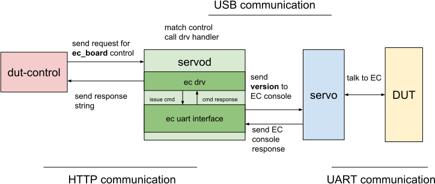

# Servod Overview

This is intended to give a brief overview of how the servo code works, enabling
developers to quickly make additions, and improve the servo framework.

[TOC]

## Installation

To make changes to `servod` (board overlays, python code, etc), you need to
`cros_workon` before `emerge`'ing `hdctools`:

```bash
(chroot) $ cros_workon --host start hdctools
(chroot) $ sudo emerge hdctools
```

## Terminology

*   config file

    `.xml` files that outline what controls a servod instance will expose. These
    can be found inside `data/`. [Example][2].

*   `drv`

    The drivers used to execute controls. [Example][17].

    ```xml
      <control>
        <name>ppvar_vbat_ma</name>
        <doc>milliamps being consumed (discharging/positive) or
        supplied (charging/negative) to the battery</doc>
        <params cmd="get" subtype="milliamps" interface="10" drv="ec">
        </params>
      </control>
    ```

*   `control`

    A control - like `ppvar_vbat_ma` - is defined in a configuration file and
    executes code on invocation through dut-control or an RPC proxy. `

*   `params`

    Params are a dictionary of parameters that controls are defined with, and
    are used to execute the control. The params list is passed to the drv on
    initialization for a specific control.

*   `interface`

    The interface describes what interface the drv should use to execute a
    control. Some important interfaces are: 8 == AP console, and 10 == EC
    console.

*   `map`

    In the servod world a `<map>` is used to map a human readable name to a
    numerical value. E.g. the "`onoff`" map defines on = 1 and off = 0.

## System overview

The servo framework works by having a servod instance (a server to process
requests) running and executing controls with the help of physical servo devices
(v2, v4 etc).

The `servod` instance is invoked with a couple of implicit configuration files
(like `common.xml`) and some explicit configuration files (like when invoking
`sudo servod -b lulu -c lulu_r2.xml`). These configuration files define the
controls this servod instance can handle, and configure how to execute them.

### What happens when we type dut-control ec_board (birds-eye view):

The following graphic shows how a call to `dut-control ec_board` works.



1.  The `dut-control` control issues a request to the servo server, asking it to
    get the control `ec_board`.

2.  The servod [instance][14] then looks up what the control `ec_board` means,
    and how to execute it. It uses its [system config][15] to find the `drv` and
    the params used to execute an `ec_board` request.

3.  The server initializes and keeps around an ec `drv` instance to execute the
    `ec_board` control.

    *** note
    Note: This is crucial, because it means that one can share state between
    two invocations of `ec_board` - since they use the same `drv` instance to
    execute them - but not as easily between two invocations of different
    controls, since they will use different `drv` instances to execute.
    ***

4.  The server then dispatches an attempt to retrieve the information by calling
    `.get()` on the `drv`.

5.  The return value then gets propagated all the way back up until finally
    `dut-control` prints out the response on the terminal.

## Data and Configuration file structure

A configuration file is an xml file that has `<control>`, `<map>`, and
`<include>` elements as top level tags.

*   `<control>` [elements][2]

    These elements define what you would use for `dut-control`. They are for
    instance `pwr_button`, `ec_board`, etc.

    `<control>` elements can have the following subtags:

    *   `<name>`: Defines the control’s name. _required_.
    *   `<doc>`: A docstring to display.
    *   `<alias>`: Alias is another name to use for this control.
    *   `<params>`: Params used to instantiate a driver.

        This allows for generic drivers that get the information they need
        passed through by the params dictionary. _required_. See more below.

    *   `<remap>` Remap makes the control at `<remap>` an alias for the control.
        See [FAQ][16] for details.

    *** note
    Note: two params may be defined if the params for the `set` version of the
    control is different from the `get` version of the control. In that case,
    the params are required to have a `cmd` attribute each, one defined as
    `get` the other defined as `set` to [distinguish between them][1].
    ***

*   `<include>` [elements][3]

    These elements indicate a config file to source before this config file.
    They only have one subtag, `<name>` with the config file name.

*   `<map>` [elements][4]

    These elements are string to numerical value mappings that can be used when
    setting a control. When the user calls `pwr_button:press`, there is a config
    file loaded into the servod instance that [defines a map][5] to map `press`
    to a numerical value. The [`pwr_button` control][6] uses that map in its
    params.

    Maps use a `<name>` tag to indicate their name, and _one_ `<params>` tag to
    configure the transformations.

## Drv structure

`drv` (drivers) are classes used to perform the actions listed out in the
configuration file. These drivers handle low level communication, and execution
of the control.

[HwDriver][7] is the source of all drivers, and needs to be inherited from when
building out a new driver. It contains the logic for calling the
`_Set_|control_name|` of a derived class when a control with a subtype is
defined.

Another important driver is [ptyDriver][8] that the EC, AP, and Cr50 console
controls use.

As mentioned above, it’s crucial to note that drivers get instantiated with a
set of params for each control.

## Interfaces and their usage

Interfaces are what get passed to a driver to use for control execution. These
can either be real interfaces, or the servod instance, if
[`interface="servo"`][9] is defined in the params.

Inside [servo_interfaces.py][10] one can see all the interfaces defined for each
servo type (v2, v4, ccd, etc). The interface index in the list is what the
interface attribute in the params dictionary specifies.

The driver needs to know what interface it is expecting in order to meaningfully
execute a control.

## Params

In general, params can be any parameters that the config file writer decides to
add that are needed for a driver. However, there are a couple special parameters
that one should be aware of:

*   `map`

    As a parameter map tells servod what map to use for input on this control.

*   `cmd`

    Either `set` or `get`. On controls with different params for `get` and `set`
    method this needs to be defined to associate the right params dictionary to
    the right method.

*   `fmt`

    [`fmt` function to execute][11] on output values. Currently only supports
    hex.

*   `subtype`

    If a driver has more than one method it exposes, then subtype defines what
    method should be called to execute a given control. The method [called][12]
    on the driver instance then is drv.`_(Set|Get)_|subtype|`.

*   `input_type`

    Input on set methods will be [cast][13] to `input_type`. Currently `float`,
    `int`, and `str` are supported.

*   `interface`

    Index of the interface to use for this control. `servo` if the interface is
    intended to be the `servod` instance.

*   `drv`

    String of the python module that contains the driver for this control.

## Servo type specific behavior.

There are two mechanism in servod to allow for controls to have different
configurations depending on the type of servo device used: type specific drivers
and interfaces in the control's configuration.

A control can specify a more specific interface or drv instead of using the
global `interface` and `drv` params its params dictionary for a specific servo
type. This would look like `servo_micro_interface` and `servo_micro_drv` These
params would be used in a servo_micro servod instance before the general
`interface` and `drv` params, but ignored in a non servo_micro instance. Take a
look at [`ftdi_common.py`][20] to see the exact name strings.

# Servod Helpers

## Servo Parsing

There are two types of servod parsings: parsing for a client (e.g. dut-control)
and parsing for servod itself. Additionally servod supports runtime
configurations using a config file, to map serialname to symbolic name.

`servod -b samus -s xxx-yyy -> servod -n my_samus //where servodrc has my_samus,
xxx-yyy`

With that, there are some helpers to make parsing easier and more unified.
The purpose is for shared arguments and shared parsing logic
(e.g. runtime configuration mappings) to live in one place, to ensure a
consistent cmdline experience across servod tools, and to simplify and
centralize future changes.
Please see [this top comment][21] for an overview.

## Servodutil {#servod-util}

[`servodutil`][18] is a cmdline tool (and library) to manage `servod` instances.
It supports listing all instances running on a system and their info (e.g., what
port they run on, what the main process' PID is, what the serial numbers of the
attached servo devices are), and gracefully stopping an instance.

It works by writing all the information into a file at `/tmp/servoscratch` on
invocation and clearing out the entry when `servod` turns off. This flow is
supported for almost all methods of turning off `servod`: `Ctrl-C`, `servodutil
stop`, or sending a `SIGTERM` to the main process.

Should it become necessary for `servod` to be killed using `SIGKILL`, `servod`
cannot perform a clean-up and stale entries will be left around. On each usage
of `servodutil`, or invocation of `servod`, the system attempts to clean out
stale entries.

The inverse is also problematic: should it for some reason become necessary to
delete `/tmp/servoscratch`, then existing instances are not tracked. For this,
`servodutil rebuild` provides a way to try and rebuild lost entries.

## ServoDeviceWatchdog {#servo-device-watchdog}

[`ServoDeviceWatchdog`][19] is a thread that regularly polls to ensure all
devices that a `servod` instance started with are still connected. Should this
not be the case, it will issue a signal to the `servod` instance to turn itself
off.

The one exeption here is `ccd`: for ccd as it is hosted by cr50, the watchdog
allows for a reinit period, where if the connection to cr50 is lost (cr50
reboot, cable unplug, etc) and the device is found again within the timeout
period, the interface is reinitialized. Controls issued during the
reinitalization phase will block until the interface is reinitialized.

[1]: https://chromium.googlesource.com/chromiumos/third_party/hdctools/+/master/servo/system_config.py#220
[2]: https://chromium.googlesource.com/chromiumos/third_party/hdctools/+/master/servo/data/ec_common.xml
[3]: https://chromium.googlesource.com/chromiumos/third_party/hdctools/+/master/servo/data/servo_glados_overlay.xml#2
[4]: https://chromium.googlesource.com/chromiumos/third_party/hdctools/+/master/servo/data/common.xml
[5]: https://chromium.googlesource.com/chromiumos/third_party/hdctools/+/master/servo/data/common.xml#95
[6]: https://chromium.googlesource.com/chromiumos/third_party/hdctools/+/master/servo/data/servo_micro.xml#194
[7]: https://chromium.googlesource.com/chromiumos/third_party/hdctools/+/master/servo/drv/hw_driver.py#38
[8]: https://chromium.googlesource.com/chromiumos/third_party/hdctools/+/master/servo/drv/pty_driver.py
[9]: https://chromium.googlesource.com/chromiumos/third_party/hdctools/+/master/servo/data/arm_ec_common.xml#14
[10]: https://chromium.googlesource.com/chromiumos/third_party/hdctools/+/master/servo/servo_interfaces.py
[11]: https://chromium.googlesource.com/chromiumos/third_party/hdctools/+/master/servo/system_config.py#455
[12]: https://chromium.googlesource.com/chromiumos/third_party/hdctools/+/master/servo/drv/hw_driver.py#72
[13]: https://chromium.googlesource.com/chromiumos/third_party/hdctools/+/master/servo/system_config.py#382
[14]: https://chromium.googlesource.com/chromiumos/third_party/hdctools/+/master/servo/servo_server.py#52
[15]: https://chromium.googlesource.com/chromiumos/third_party/hdctools/+/master/servo/system_config.py#19
[16]: ./FAQ.md#how-do-i-reroute_overwrite-a-control-for-a-board-tl_dr
[17]: https://chromium.googlesource.com/chromiumos/third_party/hdctools/+/master/servo/drv/ec.py
[18]: https://chromium.googlesource.com/chromiumos/third_party/hdctools/+/master/servo/servodutil.py
[19]: https://chromium.googlesource.com/chromiumos/third_party/hdctools/+/master/servo/servod.py#69
[20]: https://chromium.googlesource.com/chromiumos/third_party/hdctools/+/master/servo/ftdi_common.py#28
[21]: https://chromium.googlesource.com/chromiumos/third_party/hdctools/+/master/servo/servo_parsing.py#16
