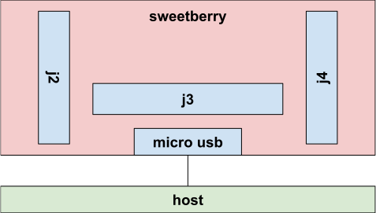

# Sweetberry Configuration

[TOC]

## Requirements

Sweetberry with firmware version `sweetberry_v1.1.8453-11bd4c0f4` or higher

## Background

*   physical bank: j2, j3, j4 the white banks physically on the sweetberry board
*   i2c port: the i2c port used for a reading
*   i2c address: the hex address to use on a given port
*   android connector: large black connector on the back (the side oppposite to
    the bank connectors)
*   sweetberry config template: `.py` power template with
    `config_type='sweetberry'`

## Intro

As explained in the [INA docs], sweetberry configuration using raw i2c addresses
and ports is difficult. Each physical bank on the sweetberry board is wired to
INAs on different i2c lines (thus using different ports) while some of those
INAs have the same i2c slave address. Since most use cases in Chrome OS for
sweetberry are with a medusa header, the user is more likely to easily know the
physical bank, and the pins. `generate_ina_controls.py` allows for an
alternative configuration using the pin numbers as a tuple (e.g. `(1,3)`) and
the location variable to be the physical bank number. Lastly, we also support
configurations using the android connector on the back of the device to monitor
all channels through a power board. This uses a different pin mux. In that case,
one would take the schematic and map them to their corresponding channel, either
through using the pin configuration and writing `android` into the mux field,
which might be the easiest way to write those. However, for completeness, (for j
banks and android connector) please see the conversion table below. It explains
how these values are connected, and can be used to write a sweetberry config
template.

## Sweetberry device layout

## Layout of sweetberry configuration

### Key to interpret pin map

pins  | j2                | j3                | j4
----- | ----------------- | ----------------- | -----------------
xx,xx | i2c-addr i2c-port | i2c-addr i2c-port | i2c-addr i2c-port

### Pin Map

pins  | j2     | j3     | j4
----- | ------ | ------ | ------
1,3   | 0x40 3 | 0x44 3 | 0x48 3
2,4   | 0x40 1 | 0x44 1 | 0x48 1
6,8   | 0x40 2 | 0x44 2 | 0x48 2
7,9   | 0x40 0 | 0x44 0 | 0x48 0
11,13 | 0x41 3 | 0x45 3 | 0x49 3
12,14 | 0x41 1 | 0x45 1 | 0x49 1
16,18 | 0x41 2 | 0x45 2 | 0x49 2
17,19 | 0x41 0 | 0x45 0 | 0x49 0
21,23 | 0x42 3 | 0x46 3 | 0x4a 3
22,24 | 0x42 1 | 0x46 1 | 0x4a 1
26,28 | 0x42 2 | 0x46 2 | 0x4a 2
27,29 | 0x42 0 | 0x46 0 | 0x4a 0
31,33 | 0x43 3 | 0x47 3 | 0x4b 3
32,34 | 0x43 1 | 0x47 1 | 0x4b 1
36,38 | 0x43 2 | 0x47 2 | 0x4b 2
37,39 | 0x43 0 | 0x47 0 | 0x4b 0

### Android pin map

pins       | android
---------- | -------
(2, 8)     | 0x40 1
(4, 10)    | 0x40 0
(6, 12)    | 0x41 1
(7, 13)    | 0x40 3
(9, 15)    | 0x40 2
(11, 17)   | 0x41 3
(19, 25)   | 0x41 2
(20, 26)   | 0x41 0
(21, 27)   | 0x42 3
(22, 28)   | 0x42 1
(23, 29)   | 0x42 2
(24, 30)   | 0x42 0
(32, 38)   | 0x43 1
(34, 40)   | 0x43 0
(36, 42)   | 0x44 1
(37, 43)   | 0x43 3
(39, 45)   | 0x43 2
(41, 47)   | 0x44 3
(49, 55)   | 0x44 2
(50, 56)   | 0x44 0
(51, 57)   | 0x45 3
(52, 58)   | 0x45 1
(53, 59)   | 0x45 2
(54, 60)   | 0x45 0
(62, 68)   | 0x46 1
(64, 70)   | 0x46 0
(66, 72)   | 0x47 1
(67, 73)   | 0x46 3
(69, 75)   | 0x46 2
(71, 77)   | 0x47 3
(79, 85)   | 0x47 2
(80, 86)   | 0x47 0
(81, 87)   | 0x48 3
(82, 88)   | 0x48 1
(83, 89)   | 0x48 2
(84, 90)   | 0x48 0
(92, 98)   | 0x49 1
(94, 100)  | 0x49 0
(96, 102)  | 0x4a 1
(97, 103)  | 0x49 3
(99, 105)  | 0x49 2
(101, 107) | 0x4a 3
(109, 115) | 0x4a 2
(110, 116) | 0x4a 0
(111, 117) | 0x4b 3
(112, 118) | 0x4b 1
(113, 119) | 0x4b 2
(114, 120) | 0x4b 0

[INA docs]: ./ina.md
